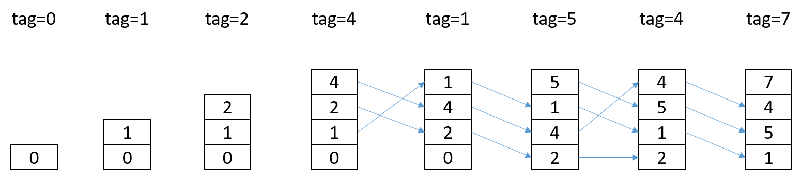

_Übungsaufgabe zur Veranstaltung [IT Systeme](https://hsro-wif-oop.github.io) im [Bachelorstudiengang Wirtschaftsinformatik](https://www.th-rosenheim.de/technik/informatik-mathematik/wirtschaftsinformatik-bachelor/) an der [Hochschule Rosenheim](http://www.th-rosenheim.de)._


# Caches

In dieser Übung verwenden wir Java (Hurray, das kennen wir noch aus dem letzten Semester!) und versuchen mal 2 Cache-Strategien zu implementieren. Als Vereinfachung steht eine Klasse *Storage* zur 
Verfügung, die eine Methode *get* anbietet und den Speicherzugriff simulieren soll.

Ausserdem halten wir absichtlich die Datenstruktur einfach. In unserem Cache werden *int* Werte gecached und der Speicher gibt auch nur entsprechende *int*-Werte zurück.

Damit kann ein Fokus auf die Strategie gelegt werden. Natürlich liessen sich hier sehr gut auch Generics verwenden :-).

**Bitte melden Sie sich bei Github an und forken dieses Repo (so, wie wir es in OOP gemacht haben!).**


## Aufgabe 1: RandomCache

In einem *RandomCache* werden die Elemente zufällig ersetzt. Wird ein Element nicht im Cache gefunden, so muss es aus dem Speicher (hier: Die Klasse *Storage*) geladen werden. 
Wird das Element geladen, so wird es danach im Cache abgelegt, da es ja wieder benötigt werden koennte. Beim *RandomCache* wird
es an einer beliebigen (zufaelligen) Stelle abgelegt.

in Java kann it der Klasse *java.util.Random* eine Zufallszahl erzeugt werden.

```java
Random rnd = new Random();
int i = rnd.nextInt(size);  // erzeugt eine zufaeelige ganze Zahl zwischen 0 und size (0 <= i <= size)
```

- Vervollständigen Sie die Implementierung der Klasse `RandomCache` gemäß den vorgegebenen JavaDoc Kommentaren.
- Wählen Sie eine geeignete interne Datenstruktur, die den Cache für die gegebene Grösse repräsentiert (Ideen: Integer[],
ArrayList, LinkedList, HashMap, ...)
- Erhöhen sie an der geeigneten Stelle die Werte fuer *hits* und *misses*

- Verifizieren Sie Ihre Implementierung anhand der gelieferten Testcases in der Testklasse *RandomCacheTest*, überlegen Sie für
den *testLRUCacheComplex* zunächst auf dem Papier was passieren kann. 


**Kann es passieren, dass der Test nicht immer durchläuft?**

## Aufgabe 2: LRUCache

Implementieren Sie nun eine LRUCache-Strategie. Dabei soll in einem Cache mit gegebener Größe das Element an der ersten
Position eingefügt werden, auf das als letztes zugegriffen wurde. Dabei kann passieren, dass das "älteste" Element dann aus
dem Cache herausfällt.

Für einen Cache der Größe 4 könnte das so aussehen:




- Vervollständigen Sie die Implementierung der Klasse `LRUCache` gemäß den vorgegebenen JavaDoc Kommentaren.
- Wählen Sie eine geeignete interne Datenstruktur, die den Cache für die gegebene Grösse repräsentiert (Ideen: Integer[], ArrayList, LinkedList, HashMap, ...)
- Erhöhen sie an der geeigneten Stelle die Werte fuer *hits* und *misses*
- Verifizieren Sie Ihre Implementierung anhand der gelieferten Testcases in der Testklasse *LRUCacheTest*.


# Aufgabe 3: Abstrakte Oberklasse

Wenn Sie nun die beiden Implementierungen für *RandomCache* und *LRUCache* vergleichen, so lassen sich Gemeinssamkeiten erkennen.

Versuchen Sie eine gemeinsame Oberklasse (abstrakt?) *AbstractCache* zu implementieren, die gemeinsame Funktionen und Properties beinhaltet.


Die Musterlösung finden Sie im Branch *Musterlösung*